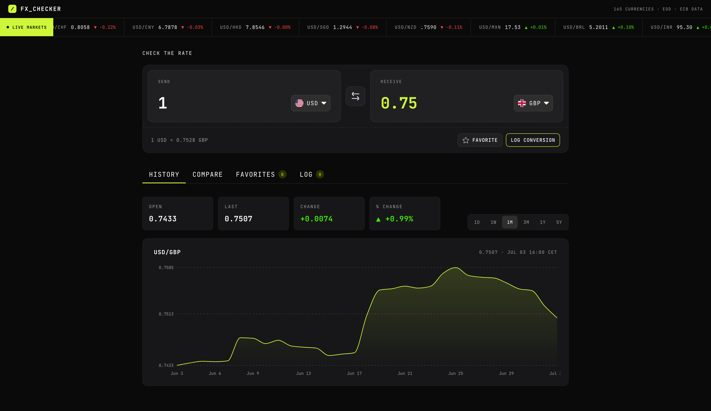

# Frontend Mentor - FX Checker solution

This is a solution to the [FX Checker challenge on Frontend Mentor](https://www.frontendmentor.io/challenges/foreign-exchange-currency-converter). Frontend Mentor challenges help you improve your coding skills by building realistic projects.

## Table of contents

- [Overview](#overview)
  - [The challenge](#the-challenge)
  - [Screenshot](#screenshot)
  - [Links](#links)
- [My process](#my-process)
  - [Built with](#built-with)
  - [Workflow: design → design system → UI](#workflow-design--design-system--ui)
  - [What I learned](#what-i-learned)
  - [Continued development](#continued-development)
  - [Useful resources](#useful-resources)
  - [AI Collaboration](#ai-collaboration)
- [Author](#author)
- [Acknowledgments](#acknowledgments)

## Overview

### The challenge

FX_CHECKER is a dark-mode currency app: convert between currencies using **live**
exchange rates, watch a live-markets ticker, explore a rate-history chart, compare an
amount across many currencies, pin favorite pairs, and keep a running conversion log.
Rates come from a live API; the user's own data (favorites, log, last tab) persists in
the browser — no accounts.

Users can:

#### Converter
- Enter an amount to send and see it convert in real time as they type
- Pick the "send" and "receive" currencies from a searchable currency picker
- See the live exchange rate for the active pair (e.g. `1 USD = 0.8530 EUR`)
- Swap the send and receive currencies with the swap button
- Favorite the active pair, and log a conversion to their history

#### Currency picker
- Search the full list of available currencies by code or name
- See currencies grouped into "Popular" and "Other currencies", each row showing the flag, code, and name
- See a check against the currency that's currently selected

#### Live markets ticker
- See a ticker of currency pairs, each with its current rate and real 24-hour change (up or down)

#### Rate history
- View an area chart of the active pair's rate over time
- Switch the chart range between 1D, 1W, 1M, 3M, 1Y, and 5Y
- See the open, last, absolute change, and percentage change for the selected range

#### Compare
- See their send amount converted into a range of other currencies at once, each with its reference rate
- Pin or unpin any comparison row to their favorites
- Get prompted to enter an amount when the send field is empty

#### Favorites
- See their pinned pairs, each with its live rate and 24-hour change
- Load a pinned pair back into the converter by selecting its row
- Unpin a pair they no longer want to track

#### Conversion log
- See a log of conversions, each showing the relative time, the pair, and the send and receive amounts
- Delete an individual entry, or clear the whole log

#### UI & accessibility
- View the optimal layout for their device's screen size (desktop / tablet / mobile)
- See hover and focus states for all interactive elements
- Navigate the entire app using only the keyboard, with screen-reader announcements for the converted amount, pins, and logged conversions

### Screenshot




### Links

- Solution URL: [github.com/kcde/fx-checker](https://github.com/kcde/fx-checker)
- Live Site URL: _Not yet deployed._

## My process

### Built with

- Semantic HTML5 markup (ARIA tabs, listbox pickers, live regions)
- CSS custom properties — a design-token layer in [`src/styles/tokens.css`](./src/styles/tokens.css)
- Flexbox & CSS Grid
- Responsive layout across desktop / tablet / mobile breakpoints
- [React 19](https://react.dev/) — UI library
- [Vite](https://vitejs.dev/) — build tool & dev server
- [Recharts](https://recharts.org/) — the rate-history area chart
- [Frankfurter API](https://frankfurter.dev/) — free, key-less, ECB-backed FX rates
- `Context` + `useReducer` for global state, `localStorage` for persistence
- [JetBrains Mono](https://fonts.google.com/specimen/JetBrains+Mono) via Google Fonts

State lives in a `Context` + `useReducer` store that hydrates favorites, the log, and
the last-open tab from `localStorage`. Data fetching is isolated in custom hooks
(`useCurrencies`, `useRates`, `useRateHistory`, `useMarketTicker`, `useFavoriteRates`)
over a thin API client with an in-memory cache (per-endpoint TTLs). Routing is a small
hash router (`#/` for the app, `#/components` for the component galleries).

### Workflow: design → design system → UI

The real goal of this build was to test a **repeatable, efficient way to go from a
design to a faithful UI with Claude** — getting the result as close to the design as
possible, which is often the hardest part. The whole pipeline was AI-assisted and
bottom-up, design-system first — starting with **Claude Design** to capture the design
in a form Claude can understand:

1. **Capture the design system with Claude Design.** Use
   [Claude Design](https://www.anthropic.com/news/claude-design-anthropic-labs)
   (Anthropic Labs) to build a design system from the design — capturing its color ramp,
   accents, spacing, type, radii, and components in a form Claude can reason about and
   reuse consistently across the project. This is the pivotal step: it grounds everything
   that follows in the real design, so the tokens and components stay true to the source.
2. **Codify the tokens with Claude.** Translate that design system into CSS custom properties in
   [`src/styles/tokens.css`](./src/styles/tokens.css) — a single source of truth for
   color, spacing, radius, and type. Everything downstream references tokens, never
   hard-coded values.
3. **Build the component library with Claude, in isolation.** Build the reusable primitives and
   composed rows (buttons, inputs, tabs, currency / compare / favorites / log rows,
   `Icon`, `Flag`) to match the design, each rendering its documented states via a
   `state` prop, and showcase them all in gallery pages (`DesignSystemPage`,
   `ComponentsPage`) behind a hash router (`#/components`).
4. **Compose and wire.** Import those components into the real app and connect them to
   live data and state — keeping every change **additive** (behavior props alongside the
   existing `state` prop) so the galleries kept working as a living reference.

Because the tokens and components were locked to the design up front, assembling each
screen became mostly composition, and staying faithful to the design came down to token
and prop tweaks rather than rebuilds — exactly the efficiency and fidelity this project
set out to test. The app itself was then built up milestone by milestone (data layer →
state → converter → picker → ticker → chart → tabs → responsive → accessibility).

### What I learned

**One request for the whole ticker's 24-hour change.** Frankfurter's historical range
endpoint returns flat `{ date, quote, rate }` rows across every day _and_ quote, so a
single call yields both the latest fixing and the previous one for every ticker pair —
no per-pair fan-out:

```js
// take the last two fixings per quote → % change + direction
const rate = series[series.length - 1].rate;
const prev = series.length > 1 ? series[series.length - 2].rate : null;
const pct = prev ? ((rate - prev) / prev) * 100 : 0;
```

**A dependency that _throws_ instead of returning empty can blank the whole app.** The
flag lookup library throws for ~20 of the API's currency codes (metals, IMF SDR, etc.).
Because the picker renders a flag for every currency, one throwing code crashed the
entire list render (React 19 unmounts the tree on an uncaught render error). Guarding it
fixed the blank screen and hardened every currency list:

```js
try {
  results = currencyToCountry(currencyCode);
} catch {
  return null; // fall back to no flag instead of crashing the list
}
```

**Manual-activation tabs.** Following the WAI-ARIA tabs pattern, arrow keys only _move
focus_ between tabs; the panel switches on Enter/Space. That matters here because
switching tabs kicks off live-rate and chart fetches — you don't want to trigger all of
them just by arrowing past.

**Focus rings on a dark UI.** An `outline` only renders rounded corners when the element
itself has a `border-radius`, and a scroll container (`overflow-x: auto`) clips outward
rings on every side — so the tablist needed an _inset_ ring, and the active underline
had to step aside while a tab is focused.

### Continued development

- Deploy to a live URL (Vercel / Netlify / GitHub Pages)
- A light theme toggle alongside the dark-first design
- Persist the active pair in the URL for shareable/bookmarkable conversions
- Cache the last successful rates and fall back to them with an "out of date" banner when the API is unreachable
- A hover crosshair on the rate chart, and CSV export of the conversion log

### Useful resources

- [Frankfurter API docs](https://frankfurter.dev/) — endpoints for currencies, latest rates, and historical ranges
- [ARIA Authoring Practices: Tabs pattern](https://www.w3.org/WAI/ARIA/apg/patterns/tabs/) — manual vs. automatic activation
- [Recharts documentation](https://recharts.org/en-US/api) — the `AreaChart` used for rate history
- [MDN: `:focus-visible`](https://developer.mozilla.org/en-US/docs/Web/CSS/:focus-visible) — keyboard-only focus styling

### AI Collaboration

This project was built with **Claude Code** (Anthropic's Claude) as an implementation
partner, milestone by milestone.

- **Tools:** [Claude Design](https://www.anthropic.com/news/claude-design-anthropic-labs) (Anthropic Labs — builds a design system from your design files so Claude uses your colors, type, and components consistently) and Claude Code (CLI, for the build).
- **How:** planning each milestone before coding, writing the components/hooks/CSS,
  and debugging — e.g. the flag-library crash, clipped/rounded focus rings, the Firefox
  number-spinner, and the favorite-row keyboard handler hijacking the star button.
- **What worked well:** fast scaffolding of repetitive UI, and surfacing accessibility
  patterns (manual-activation tabs, roving focus, live regions) with the reasoning
  behind them. Decisions and design direction stayed with me; the AI did the grunt work
  and explained the "why".

## Author

- Frontend Mentor - [@your-username](https://www.frontendmentor.io/profile/your-username)
- GitHub - [@kcde](https://github.com/kcde)

<!-- Update the Frontend Mentor handle above (and add any other links you'd like). -->

## Acknowledgments

- [Frankfurter](https://frankfurter.dev/) for the free, ECB-backed exchange-rate API
- [Frontend Mentor](https://www.frontendmentor.io/) for the challenge and design
